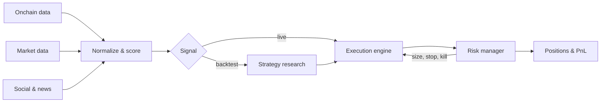

<picture>
  <source media="(prefers-color-scheme: dark)" srcset="https://raw.githubusercontent.com/LifeAnalysis/LifeAnalysis/main/.github/assets/banner-dark.svg">
  <source media="(prefers-color-scheme: light)" srcset="https://raw.githubusercontent.com/LifeAnalysis/LifeAnalysis/main/.github/assets/banner-light.svg">
  
</picture>

  
  
  
  
  
  
  
  

> Signal in, size on, risk off. Everything else is decoration.

### ⚡ Building

- 🔗 **Onchain data pipelines** — protocol scoring, wallet clustering, flow analysis
- 🤖 **Multi-agent research systems** — market intelligence with configurable pipelines
- 📉 **Perps execution** — programmatic risk management on Hyperliquid

### 🔬 Researching

- 🎲 **Prediction markets** — Polymarket and Kalshi strategy backtests
- 🌉 **Cross-chain rate spreads** — funding-basis and borrow-rate structures
- 🏛️ **Tokenized equities** — market microstructure and pricing dislocations

### 🚀 Shipping

| Repo | What it does |
|---|---|
| **[spt-index](https://github.com/LifeAnalysis/spt-index)** | DeFi protocol scoring, z-score normalized across TVL, revenue and flow |
| **[dao-buyback-dashboard](https://github.com/LifeAnalysis/dao-buyback-dashboard)** | Buyback tracking across Hyperliquid, Jupiter and Solana DAOs |
| **[optionsviz](https://github.com/LifeAnalysis/optionsviz)** | Options surface overlays for treasury positioning |
| **[Stockscalendar.xyz](https://github.com/LifeAnalysis/Stockscalendar.xyz)** | Research terminal for tokenized equities |

### 🧭 How the stack fits together

🗄️ &nbsp;<b>Also in the workshop</b>

 

- **whatsapp-outreach-bot** — Android outreach automation, multi-device, Kotlin
- Prediction-market monitors, copytrade shadowing, wallet ranking
- Perps risk tooling — ladder sizing, kill switches, exposure caps
- Assorted landing pages and prototypes that never made it past week two

---

  Most of what I build is private. The pinned repos are the public slice. 
  Reach me by opening an <a href="https://github.com/LifeAnalysis/LifeAnalysis/issues">issue</a>.

